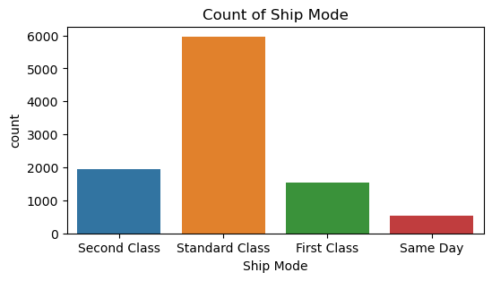
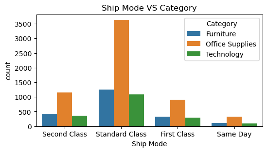
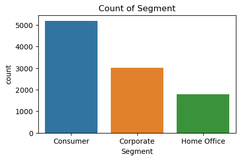
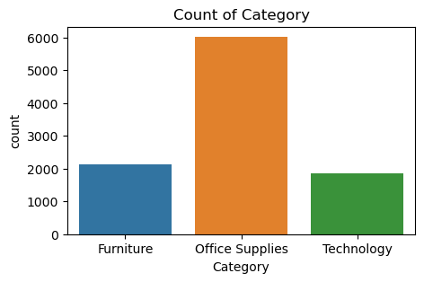
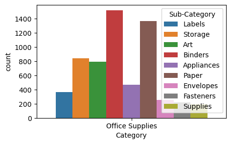
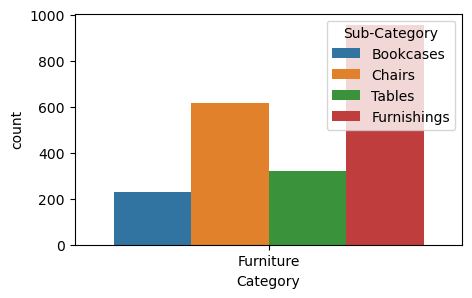
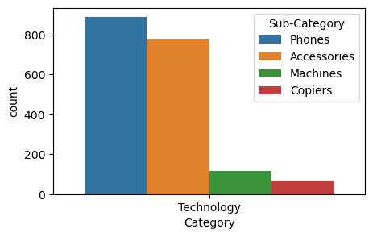
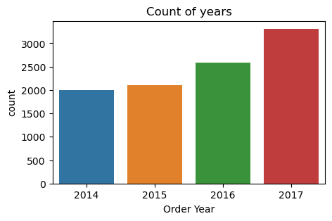
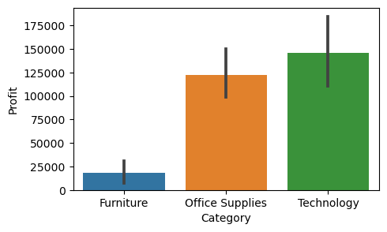

```python
import numpy as np
import pandas as pd
import seaborn as sns
import matplotlib.pyplot as plt

```


```python
ds = pd.read_csv("Sample - Superstore.csv",encoding = 'unicode_escape')
ds.head(2)
```


<div>
<style scoped>
    .dataframe tbody tr th:only-of-type {
        vertical-align: middle;
    }

    .dataframe tbody tr th {
        vertical-align: top;
    }

    .dataframe thead th {
        text-align: right;
    }
</style>
<table border="1" class="dataframe">
  <thead>
    <tr style="text-align: right;">
      <th></th>
      <th>Row ID</th>
      <th>Order ID</th>
      <th>Order Date</th>
      <th>Ship Date</th>
      <th>Ship Mode</th>
      <th>Customer ID</th>
      <th>Customer Name</th>
      <th>Segment</th>
      <th>Country</th>
      <th>City</th>
      <th>...</th>
      <th>Postal Code</th>
      <th>Region</th>
      <th>Product ID</th>
      <th>Category</th>
      <th>Sub-Category</th>
      <th>Product Name</th>
      <th>Sales</th>
      <th>Quantity</th>
      <th>Discount</th>
      <th>Profit</th>
    </tr>
  </thead>
  <tbody>
    <tr>
      <th>0</th>
      <td>1</td>
      <td>CA-2016-152156</td>
      <td>11/8/2016</td>
      <td>11/11/2016</td>
      <td>Second Class</td>
      <td>CG-12520</td>
      <td>Claire Gute</td>
      <td>Consumer</td>
      <td>United States</td>
      <td>Henderson</td>
      <td>...</td>
      <td>42420</td>
      <td>South</td>
      <td>FUR-BO-10001798</td>
      <td>Furniture</td>
      <td>Bookcases</td>
      <td>Bush Somerset Collection Bookcase</td>
      <td>261.96</td>
      <td>2</td>
      <td>0.0</td>
      <td>41.9136</td>
    </tr>
    <tr>
      <th>1</th>
      <td>2</td>
      <td>CA-2016-152156</td>
      <td>11/8/2016</td>
      <td>11/11/2016</td>
      <td>Second Class</td>
      <td>CG-12520</td>
      <td>Claire Gute</td>
      <td>Consumer</td>
      <td>United States</td>
      <td>Henderson</td>
      <td>...</td>
      <td>42420</td>
      <td>South</td>
      <td>FUR-CH-10000454</td>
      <td>Furniture</td>
      <td>Chairs</td>
      <td>Hon Deluxe Fabric Upholstered Stacking Chairs,...</td>
      <td>731.94</td>
      <td>3</td>
      <td>0.0</td>
      <td>219.5820</td>
    </tr>
  </tbody>
</table>
<p>2 rows × 21 columns</p>
</div>


```python
ds.isnull().sum()
```


    Row ID           0
    Order ID         0
    Order Date       0
    Ship Date        0
    Ship Mode        0
    Customer ID      0
    Customer Name    0
    Segment          0
    Country          0
    City             0
    State            0
    Postal Code      0
    Region           0
    Product ID       0
    Category         0
    Sub-Category     0
    Product Name     0
    Sales            0
    Quantity         0
    Discount         0
    Profit           0
    dtype: int64


```python
ds.shape
```


    (9994, 21)


```python
ds['Ship Mode'].value_counts()
```


    Standard Class    5968
    Second Class      1945
    First Class       1538
    Same Day           543
    Name: Ship Mode, dtype: int64


# Ship Mode


```python
plt.figure(figsize = (6, 3))
plt.title("Count of Ship Mode")
sns.countplot(x='Ship Mode',data = ds)
plt.show()
```


    

    


```python
plt.figure(figsize=(6,3))
plt.title("Ship Mode VS Category")
sns.countplot(x = 'Ship Mode',data = ds, hue = "Category")
plt.show
```


    <function matplotlib.pyplot.show(close=None, block=None)>


    

    


# Customer Segment


```python
plt.figure(figsize=(5,3))

plt.title("Count of Segment")
sns.countplot(x = "Segment", data = ds)
plt.show()
```


    

    


# Categorys


```python

plt.figure(figsize = ( 5,3))
plt.title("Count of Category")
sns.countplot(x = "Category",data = ds)
plt.show()
```


    

    


```python
plt.figure(figsize = ( 5,3))
sns.countplot(x = "Category",data = ds[ds["Category"]== "Office Supplies"],hue = "Sub-Category")
plt.show()
```


    

    


```python
plt.figure(figsize = ( 5,3))
sns.countplot(x = "Category",data = ds[ds["Category"]== "Furniture"],hue = "Sub-Category")
plt.show()

```


    

    


```python
plt.figure(figsize = ( 5,3))
sns.countplot(x = "Category",data = ds[ds["Category"]== "Technology"],hue = "Sub-Category")
plt.show()
```


    

    


```python
ds.info()
```

    <class 'pandas.core.frame.DataFrame'>
    RangeIndex: 9994 entries, 0 to 9993
    Data columns (total 23 columns):
     #   Column         Non-Null Count  Dtype         
    ---  ------         --------------  -----         
     0   Row ID         9994 non-null   int64         
     1   Order ID       9994 non-null   object        
     2   Order Date     9994 non-null   datetime64[ns]
     3   Ship Date      9994 non-null   datetime64[ns]
     4   Ship Mode      9994 non-null   object        
     5   Customer ID    9994 non-null   object        
     6   Customer Name  9994 non-null   object        
     7   Segment        9994 non-null   object        
     8   Country        9994 non-null   object        
     9   City           9994 non-null   object        
     10  State          9994 non-null   object        
     11  Postal Code    9994 non-null   int64         
     12  Region         9994 non-null   object        
     13  Product ID     9994 non-null   object        
     14  Category       9994 non-null   object        
     15  Sub-Category   9994 non-null   object        
     16  Product Name   9994 non-null   object        
     17  Sales          9994 non-null   float64       
     18  Quantity       9994 non-null   int64         
     19  Discount       9994 non-null   float64       
     20  Profit         9994 non-null   float64       
     21  Order Year     9994 non-null   int64         
     22   TopState      0 non-null      float64       
    dtypes: datetime64[ns](2), float64(4), int64(4), object(13)
    memory usage: 1.8+ MB
    


```python
ds["Order Date"] = pd.to_datetime(ds["Order Date"])
```


```python
ds["Order Year"] = ds["Order Date"].dt.year
```


```python
ds["Order Year"].value_counts()
```


    2017    3312
    2016    2587
    2015    2102
    2014    1993
    Name: Order Year, dtype: int64


```python
plt.figure(figsize= (5,3))
plt.title("Count of years")
sns.countplot(x ="Order Year", data = ds)
plt.show
```


    <function matplotlib.pyplot.show(close=None, block=None)>


    

    


# category of profit


```python
plt.figure(figsize= (5,3))
sns.barplot(x= "Category", y = "Profit",data = ds, estimator = 'sum')
plt.show
```


    <function matplotlib.pyplot.show(close=None, block=None)>


    

    


```python
ds["State"].value_counts()[:5]
```


    California      2001
    New York        1128
    Texas            985
    Pennsylvania     587
    Washington       506
    Name: State, dtype: int64


```python

```


```python

```
